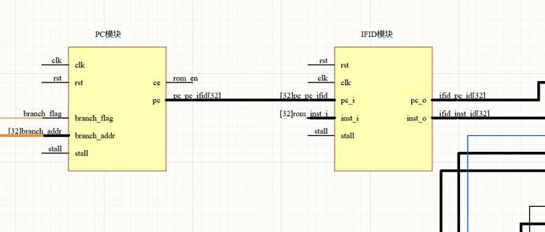
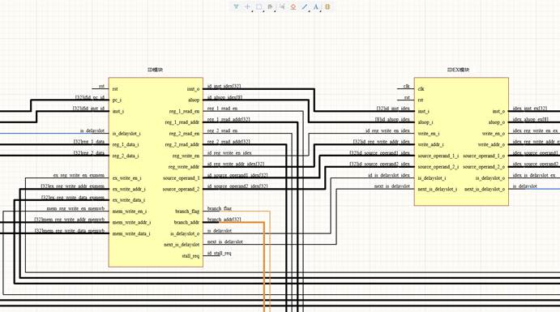
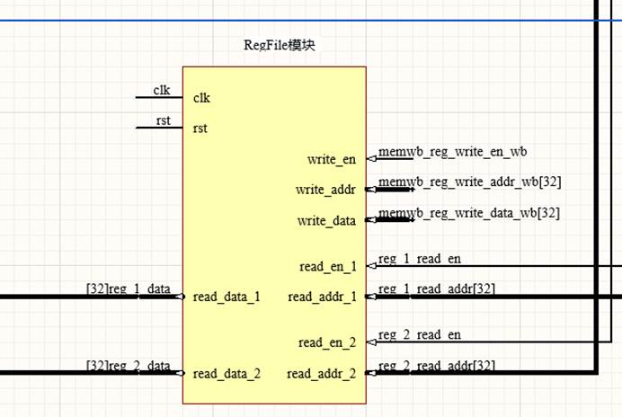
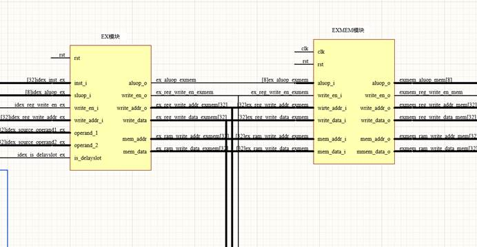
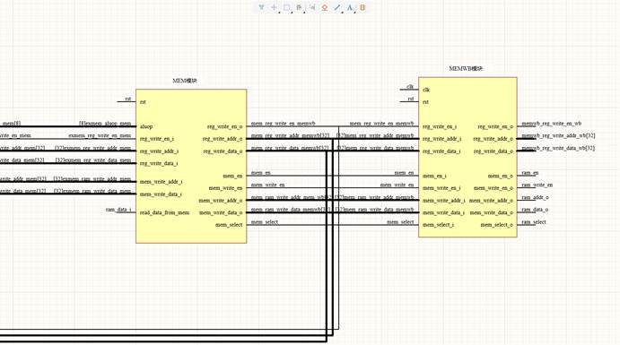
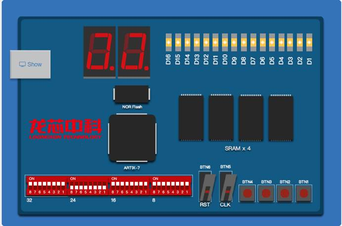
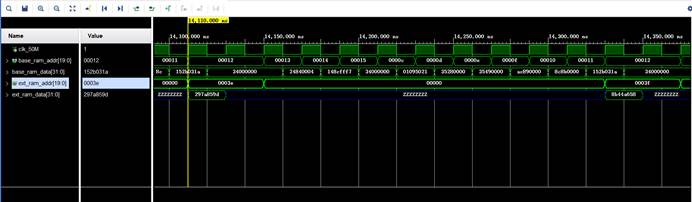
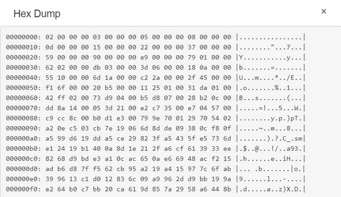

# KannyMIPS

学校 University of Science and Technology Beijing

##### 一、设计简介

一个简单的支持部分MIPS指令的CPU，采用五级流水线，设计实现了数据预取以及延迟槽处理。能完成功能测试一。

##### 二、设计方案

###### （一）总体设计思路

参考雷思磊前辈的《自己动手写CPU》实现了一个简单的五级流水CPU 。

###### （二）IF模块设计

Stall: 暂停信号，由ID级传过来，如果是访存指令则让PC暂停一个时钟周期。

###### （三）ID模块设计

ID模块主要实现了指令译码，以及识别是否是延迟槽指令并对指令进行处理，以及产生stall信号。

RegFIle模块用来实现32个32位寄存器组

###### （三）EX模块设计

EX模块将传经来的操作数根据不同的操作类型对操作数经行运算，并将得出的结果传向下一级，同时实现了数据前递。使有数据冲突的指令在不暂停流水线的情况下可以拿到数据。

###### （三）MEM模块设计

将数据在下一个时钟周期上升沿传递给regfile模块。

 

##### 三、设计结果

###### （一）设计交付物说明

说明所提交设计的目录层次，各目录下对应的内容是什么。提供所提交设计进行仿真、综合、上板演示的必要操作提示步骤。

仿真：

这是需要写入的最后两个内存地址的数据，分别为297a859d和8b44a658。结果正确。

上板：

在baseram中写入数据后查看extram中0~100地址的数据如上，结果正确。

###### （二）设计演示结果

一级等级评测结果。

##### 四、参考设计说明

这个CPU的学习过程参考了雷思磊先生的《自己动手写CPU》。

##### 五、参考文献

​    无。